# Conductor Parallel Timeline & Gantt Chart Report

This report visualizes the parallel development tracks processed from the git repository history.

## Parallel Agent Workload (Mermaid Gantt Chart)

```mermaid
gantt
    title Conductor Tracks Parallel Development Timeline
    dateFormat YYYY-MM-DD HH:mm
    axisFormat %m-%d
    todayMarker off
    section #N/A Implement Core Incident Command System and Le...
        Spec Created & Init :milestone, active, 2026-05-29 12:05, 0m
        Implementation :crit, active, 2026-05-29 12:05, 2026-05-29 12:56
        Merged to Main :milestone, 2026-05-29 12:56, 0m
    section #N/A Implement Mock Diagnostics and Fast E2E Incid...
        Spec Created & Init :milestone, active, 2026-05-29 12:56, 0m
        Implementation :crit, active, 2026-05-29 12:56, 2026-06-01 07:56
        Merged to Main :milestone, 2026-06-01 07:56, 0m
    section #N/A Create SRE Web Dashboard for live simulation ...
        Spec Created & Init :milestone, active, 2026-06-01 07:58, 0m
        Implementation :crit, active, 2026-06-01 07:58, 2026-06-01 08:07
        Merged to Main :milestone, 2026-06-01 08:07, 0m
    section #N/A Integrate Communications Lead Madhavi with Te...
        Spec Created & Init :milestone, active, 2026-06-01 16:32, 0m
        Implementation :crit, active, 2026-06-01 16:32, 2026-06-01 16:35
        Merged to Main :milestone, 2026-06-01 16:35, 0m
    section #N/A Implement Modular Skill Adapter allowing SRE ...
        Spec Created & Init :milestone, active, 2026-06-01 16:37, 0m
        Implementation :crit, active, 2026-06-01 16:37, 2026-06-01 16:38
        Merged to Main :milestone, 2026-06-01 16:38, 0m
    section #27 Initialize Live GCP Connectors Track to conne...
        Spec Created & Init :milestone, active, 2026-06-01 21:04, 0m
        Implementation :crit, active, 2026-06-01 21:04, 2026-06-16 12:46
        Merged to Main :milestone, 2026-06-16 12:46, 0m
    section #26 lets add a discovery function. given a prohec...
        Spec Created & Init :milestone, active, 2026-06-01 21:23, 0m
        Implementation :crit, active, 2026-06-01 21:23, 2026-06-16 15:05
        Merged to Main :milestone, 2026-06-16 15:05, 0m
    section #N/A Manage WebChat on port 8080 and Telegram bot,...
        Spec Created & Init :milestone, active, 2026-06-02 08:32, 0m
        Implementation :crit, active, 2026-06-02 08:32, 2026-06-02 08:37
        Merged to Main :milestone, 2026-06-02 08:37, 0m
    section #N/A We should have some sort of statefulness. Sth...
        Spec Created & Init :milestone, active, 2026-06-02 08:52, 0m
        Implementation :crit, active, 2026-06-02 08:52, 2026-06-03 17:35
        Merged to Main :milestone, 2026-06-16 12:32, 0m
    section #28 If system has a conjecture to fix things whic...
        Spec Created & Init :milestone, active, 2026-06-02 08:54, 0m
        Implementation :crit, active, 2026-06-02 08:54, 2026-06-16 12:43
        Merged to Main :milestone, 2026-06-16 15:55, 0m
    section #N/A Revive SRE project discovery with multi-view ...
        Spec Created & Init :milestone, active, 2026-06-02 11:38, 0m
        Implementation :crit, active, 2026-06-02 11:38, 2026-06-02 16:17
        Merged to Main :milestone, 2026-06-16 12:32, 0m
    section #29 Interactive Telegram Incident Creation from v...
        Spec Created & Init :milestone, active, 2026-06-03 17:47, 0m
        Implementation :crit, active, 2026-06-03 17:47, 2026-06-16 12:43
        Merged to Main :milestone, 2026-06-16 12:43, 0m
    section #N/A Refactor right-hand panel  rename to SRE Seco...
        Spec Created & Init :milestone, active, 2026-06-03 17:57, 0m
        Implementation :crit, active, 2026-06-03 17:57, 2026-06-03 18:02
        Merged to Main :milestone, 2026-06-03 18:02, 0m
    section #N/A Improve Project Explorer UI by moving tabs to...
        Spec Created & Init :milestone, active, 2026-06-03 18:11, 0m
        Implementation :crit, active, 2026-06-03 18:11, 2026-06-03 18:16
        Merged to Main :milestone, 2026-06-03 18:16, 0m
    section #5 Define a strong deterministic taxonomy of sta...
        Spec Created & Init :milestone, active, 2026-06-04 09:02, 0m
        Implementation :crit, active, 2026-06-04 09:02, 2026-06-16 15:05
        Merged to Main :milestone, 2026-06-16 15:05, 0m
    section #7 Support project cross-referencing inside Proj...
        Spec Created & Init :milestone, active, 2026-06-04 09:02, 0m
        Implementation :crit, active, 2026-06-04 09:02, 2026-06-16 10:30
        Merged to Main :milestone, 2026-06-16 12:15, 0m
    section #6 Add Archive capability (direct, hides inciden...
        Spec Created & Init :milestone, active, 2026-06-04 09:02, 0m
        Implementation :crit, active, 2026-06-04 09:02, 2026-06-16 10:30
        Merged to Main :milestone, 2026-06-16 12:15, 0m
    section #1 Deploy SRE dashboard to Cloud Run via just de...
        Spec Created & Init :milestone, active, 2026-06-04 09:02, 0m
        Implementation :crit, active, 2026-06-04 09:02, 2026-06-16 10:30
        Merged to Main :milestone, 2026-06-16 15:48, 0m
    section #N/A Fix UI Navigation bug where reloading deep pr...
        Spec Created & Init :milestone, active, 2026-06-04 10:12, 0m
        Merged to Main :milestone, 2026-06-04 10:12, 0m
    section #10 Improve the wiki editing layout to optimize w...
        Spec Created & Init :milestone, active, 2026-06-04 12:27, 0m
        Implementation :crit, active, 2026-06-04 12:27, 2026-06-16 10:30
        Merged to Main :milestone, 2026-06-16 12:02, 0m
    section #9 Graduate Project Benjamin local state (incide...
        Spec Created & Init :milestone, active, 2026-06-04 12:27, 0m
        Implementation :crit, active, 2026-06-04 12:27, 2026-06-16 10:30
        Merged to Main :milestone, 2026-06-16 15:07, 0m
    section #N/A Create a SRE Demo domain under discover/domai...
        Spec Created & Init :milestone, active, 2026-06-04 17:50, 0m
        Merged to Main :milestone, 2026-06-04 17:58, 0m
    section #N/A Use SRE Extension skills to power up the agen...
        Spec Created & Init :milestone, active, 2026-06-05 09:53, 0m
        Implementation :crit, active, 2026-06-05 09:53, 2026-06-05 09:56
        Merged to Main :milestone, 2026-06-05 09:56, 0m
    section #18 Feature Request  Unified Incident Lifecycle &...
        Spec Created & Init :milestone, active, 2026-06-08 09:10, 0m
        Implementation :crit, active, 2026-06-08 09:10, 2026-06-16 14:50
        Merged to Main :milestone, 2026-06-16 16:41, 0m
    section #N/A Remove test-project-123 and disable MOCKING
        Spec Created & Init :milestone, active, 2026-06-16 12:26, 0m
        Merged to Main :milestone, 2026-06-16 13:19, 0m
    section #8 Make sense of state in multiple environments ...
        Spec Created & Init :milestone, active, 2026-06-16 12:50, 0m
        Merged to Main :milestone, 2026-06-16 15:47, 0m
    section #11 Fuse-mount discovery folder on GCS
        Spec Created & Init :milestone, active, 2026-06-16 16:18, 0m
        Implementation :crit, active, 2026-06-16 16:18, 2026-06-16 16:20
        Merged to Main :milestone, 2026-06-16 16:20, 0m
    section #22 P1 Add MCP to streamline ahents abilities
        Spec Created & Init :milestone, active, 2026-06-16 16:18, 0m
        Merged to Main :milestone, 2026-06-16 16:41, 0m
    section #19 Feature Request  Implement Workspace-based Ag...
        Spec Created & Init :milestone, active, 2026-06-16 16:18, 0m
        Merged to Main :milestone, 2026-06-16 16:19, 0m
    section #15 migrate the TF/CB logic from Pvt Codelab to h...
        Spec Created & Init :milestone, active, 2026-06-16 16:18, 0m
        Merged to Main :milestone, 2026-06-16 16:41, 0m
    section #23 Use Managed Agents API to create a solid SRE ...
        Spec Created & Init :milestone, active, 2026-06-16 16:18, 0m
        Merged to Main :milestone, 2026-06-16 17:40, 0m
    section #21 [P4][Nice-to-have] Read this great doc and ma...
        Spec Created & Init :milestone, active, 2026-06-16 16:18, 0m
        Merged to Main :milestone, 2026-06-16 16:41, 0m
    section #31 There's a BUG  track as GHI. ⚠️ DEMO / MOCK D...
        Spec Created & Init :milestone, active, 2026-06-16 16:55, 0m
        Merged to Main :milestone, 2026-06-16 16:55, 0m
```

## Detailed Milestone Log

| GHI | Conductor Track | 1. Spec Creation | 2. Impl Start | 3. Impl End | 4. Merge to Main |
| :---: | :--- | :---: | :---: | :---: | :---: |
| N/A | Implement Core Incident Command System and Le... | `2026-05-29 12:05` | `2026-05-29 12:05` | `2026-05-29 12:56` | `2026-05-29 12:56` |
| N/A | Implement Mock Diagnostics and Fast E2E Incid... | `2026-05-29 12:56` | `2026-05-29 12:56` | `2026-06-01 07:56` | `2026-06-01 07:56` |
| N/A | Create SRE Web Dashboard for live simulation ... | `2026-06-01 07:58` | `2026-06-01 07:58` | `2026-06-01 08:07` | `2026-06-01 08:07` |
| N/A | Integrate Communications Lead Madhavi with Te... | `2026-06-01 16:32` | `2026-06-01 16:32` | `2026-06-01 16:35` | `2026-06-01 16:35` |
| N/A | Implement Modular Skill Adapter allowing SRE ... | `2026-06-01 16:37` | `2026-06-01 16:37` | `2026-06-01 16:38` | `2026-06-01 16:38` |
| **#27** | Initialize Live GCP Connectors Track to conne... | `2026-06-01 21:04` | `2026-06-01 21:04` | `2026-06-16 12:46` | `2026-06-16 12:46` |
| **#26** | lets add a discovery function. given a prohec... | `2026-06-01 21:23` | `2026-06-01 21:23` | `2026-06-16 15:05` | `2026-06-16 15:05` |
| N/A | Manage WebChat on port 8080 and Telegram bot,... | `2026-06-02 08:32` | `2026-06-02 08:32` | `2026-06-02 08:37` | `2026-06-02 08:37` |
| N/A | We should have some sort of statefulness. Sth... | `2026-06-02 08:52` | `2026-06-02 08:52` | `2026-06-03 17:35` | `2026-06-16 12:32` |
| **#28** | If system has a conjecture to fix things whic... | `2026-06-02 08:54` | `2026-06-02 08:54` | `2026-06-16 12:43` | `2026-06-16 15:55` |
| N/A | Revive SRE project discovery with multi-view ... | `2026-06-02 11:38` | `2026-06-02 11:38` | `2026-06-02 16:17` | `2026-06-16 12:32` |
| **#29** | Interactive Telegram Incident Creation from v... | `2026-06-03 17:47` | `2026-06-03 17:47` | `2026-06-16 12:43` | `2026-06-16 12:43` |
| N/A | Refactor right-hand panel: rename to SRE Seco... | `2026-06-03 17:57` | `2026-06-03 17:57` | `2026-06-03 18:02` | `2026-06-03 18:02` |
| N/A | Improve Project Explorer UI by moving tabs to... | `2026-06-03 18:11` | `2026-06-03 18:11` | `2026-06-03 18:16` | `2026-06-03 18:16` |
| **#5** | Define a strong deterministic taxonomy of sta... | `2026-06-04 09:02` | `2026-06-04 09:02` | `2026-06-16 15:05` | `2026-06-16 15:05` |
| **#7** | Support project cross-referencing inside Proj... | `2026-06-04 09:02` | `2026-06-04 09:02` | `2026-06-16 10:30` | `2026-06-16 12:15` |
| **#6** | Add Archive capability (direct, hides inciden... | `2026-06-04 09:02` | `2026-06-04 09:02` | `2026-06-16 10:30` | `2026-06-16 12:15` |
| **#1** | Deploy SRE dashboard to Cloud Run via just de... | `2026-06-04 09:02` | `2026-06-04 09:02` | `2026-06-16 10:30` | `2026-06-16 15:48` |
| N/A | Fix UI Navigation bug where reloading deep pr... | `2026-06-04 10:12` | `2026-06-04 10:12` | `2026-06-04 10:12` | `2026-06-04 10:12` |
| **#10** | Improve the wiki editing layout to optimize w... | `2026-06-04 12:27` | `2026-06-04 12:27` | `2026-06-16 10:30` | `2026-06-16 12:02` |
| **#9** | Graduate Project Benjamin local state (incide... | `2026-06-04 12:27` | `2026-06-04 12:27` | `2026-06-16 10:30` | `2026-06-16 15:07` |
| N/A | Create a SRE Demo domain under discover/domai... | `2026-06-04 17:50` | `2026-06-04 17:50` | `2026-06-04 17:50` | `2026-06-04 17:58` |
| N/A | Use SRE Extension skills to power up the agen... | `2026-06-05 09:53` | `2026-06-05 09:53` | `2026-06-05 09:56` | `2026-06-05 09:56` |
| **#18** | Feature Request: Unified Incident Lifecycle &... | `2026-06-08 09:10` | `2026-06-08 09:10` | `2026-06-16 14:50` | `2026-06-16 16:41` |
| N/A | Remove test-project-123 and disable MOCKING | `2026-06-16 12:26` | `2026-06-16 12:26` | `2026-06-16 12:26` | `2026-06-16 13:19` |
| **#8** | Make sense of state in multiple environments ... | `2026-06-16 12:50` | `2026-06-16 12:50` | `2026-06-16 12:50` | `2026-06-16 15:47` |
| **#11** | Fuse-mount discovery folder on GCS | `2026-06-16 16:18` | `2026-06-16 16:18` | `2026-06-16 16:20` | `2026-06-16 16:20` |
| **#22** | P1 Add MCP to streamline ahents abilities | `2026-06-16 16:18` | `2026-06-16 16:18` | `2026-06-16 16:18` | `2026-06-16 16:41` |
| **#19** | Feature Request: Implement Workspace-based Ag... | `2026-06-16 16:18` | `2026-06-16 16:18` | `2026-06-16 16:18` | `2026-06-16 16:19` |
| **#15** | migrate the TF/CB logic from Pvt Codelab to h... | `2026-06-16 16:18` | `2026-06-16 16:18` | `2026-06-16 16:18` | `2026-06-16 16:41` |
| **#23** | Use Managed Agents API to create a solid SRE ... | `2026-06-16 16:18` | `2026-06-16 16:18` | `2026-06-16 16:18` | `2026-06-16 17:40` |
| **#21** | [P4][Nice-to-have] Read this great doc and ma... | `2026-06-16 16:18` | `2026-06-16 16:18` | `2026-06-16 16:18` | `2026-06-16 16:41` |
| **#31** | There's a BUG: track as GHI. ⚠️ DEMO / MOCK D... | `2026-06-16 16:55` | `2026-06-16 16:55` | `2026-06-16 16:55` | `2026-06-16 16:55` |
